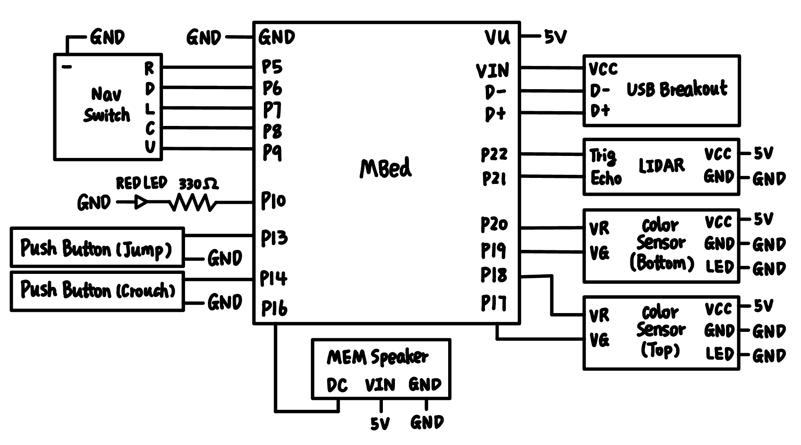
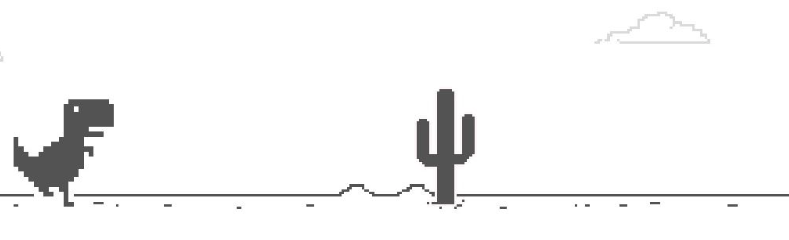
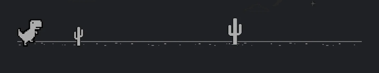

# Chrome Dino Automation

**Team Members**  
**Ruiyi Gao & Yixiao Hu**  

ECE 4180 Section B (Fall 2022) Final Project 
Georgia Institute of Technology 

## Table of Content
* [Project Idea](#project-idea)
* [Demo Videos](#demo-videos)
* [Parts List](#parts-list)
* [Block Diagram and Schematic](#block-diagram-and-schematic)
* [Software Design](#software-design)
* [Future Direction](#future-direction)
* [Source Code](#source-code)

## Project Idea
Our project idea is fairly simple!  

We want to play the chrome dino game through various ways (using different peripherals), including the ultimate goal of letting mbed play the game automatically.  

Using peripherals we used in labs, we came up with the following ways to manually play dino game using mbed:
1. **Push Buttons**  
We used two push buttons to represent the actions of the dino. The top push button makes the dino jump and the bottom makes it crouch.  
2. **Navigation Switch**  
Similar to the button idea, if nagivation switch is toggleed upward, the dino would jump. If the nagivation switch is toggled downward, the dino would crouch.
3. **Microphone**  
If the user claps their hand, the dino would jump.
4. **LIDAR**  
The player could put their hand in front of the LIDAR sensor and move toward or away form it. If the distance between LIDAR is greater than 20cm, the dino would jump. If the distance between LIDAR is less than 10cm, the dino would crouch.  

## Demo Videos
We provided an all-in-one demo so you could see every feature in one place, but there are also separate videos for each feature if you want to explore more!  

**All In One Demo**  
https://youtu.be/9GH7aEYIwp4

**Push Button Demo**  
https://youtu.be/t7vQpgjw0i8

**Navigation Switch Demo**  
https://youtu.be/jdK-0nZb1SQ

**Microphone Demo**  
https://youtu.be/ZZIuClorhCs

**SONAR Demo**  
https://youtu.be/9gRKd20tYLc

## Parts List
MBed LPC1768, https://www.sparkfun.com/products/9564  
SPST Push Buttons * 2, https://www.sparkfun.com/products/9190  
Navigation Switch, https://www.sparkfun.com/products/11187  
SPW2430 Microphone, https://www.adafruit.com/product/2716  
HDJD-S822 Color Sensor * 2, https://www.sparkfun.com/products/10904  
Mini USB Breakout, https://www.sparkfun.com/products/9966  
HC-SR04 SONAR, https://www.sparkfun.com/products/15569  

## Block Diagram and Schematic
Here is the schematic for all the components we used:

**Note: All the peripherals used 5V as power, and we didn't use external power in our project.**

## Software Design
The general in the software design is to use mbed to play a fake keyboard to the computers, which uses the library “USBDevices”. However, since it occupies the SPI communication port for mbed, any devices which uses the same API need to implement in different threads to make sure the correct functionality, especially when the peripherals were combined. Meanwhile, a mutex was used when the USBKeyboard and pc.printf were used.
### Manual Mode:
In manual mode, 4 threads were created using rtos, each controlling push buttons, navigation switch, sonar sensor, and microphone. Each peripheral has a separated source file together with the combined manual control file for clear demonstration.  
**Push Buttons:** As explained in the project ideas, two push buttons were used to trigger the UP_ARROW and DOWN_ARROW for keyboard signal using “USBDevices,” PinDetectIn was used to account for debouncing.  
**Navigation Switch:** Similar to Push Buttons, navigation switches used the toggle to control send UP_ARROW and DOWN_ARROW, nav_switches class were used as in lab1.  
**Sonar/Lidar sensor:** "HCSR04.h" library was used to control the sonar with its member function .getDistance_mm() to detect the distance as soon as possible (with maximum limit to be 400cm). If the detected distance was less than 10cm, the DOWN_ARROW signal will be sent and it would remain for 0.2 second since the crouch state for dinosaur has to be maintained before being effective in the game. On the contrary, if the distance was higher than 20cm, the UP_ARROW signal was sent and another delay of 200ms was added to make sure the dinosaur won’t keep jumping in a short period of time.  
**Microphone:** SPW2430 Microphone detects the loudness of the sound and when the current loudness increased by 20 compared with last recorded value, UP_ARROW will be sent. The reason not  to use a absolute threshold was the reading wasn’t stable, usually varies between 160 to 260 under normal lab conditions.  
**Manual:** manual control is a combination of the previous 4 peripherals and 4 threads (including main) were used to detect the readings/signals from each device and one final threads combined all trigger conditions and send signals to the laptop using serial port. So, in total there are 5 threads.  
### Automatic Mode:
Automatic Mode used two color sensors to detect the obstacles in front of the dinosaurs and jump (UP_ARROW signal) when it is found. There are three levels of obstacles in the game: low, medium, and high. There is no need for any action for the high obstacles so two sensors were used to detect the other types accordingly.  
  
Two color sensors were placed about 7cm ahead of the dinosaur so initially a 300ms delay was added to it so that the dinosaur only jumps when it approaches the obstacle. However, since the acceleration for the game is 0.0001 from the game source code (line 116), the delay time decreases linearly with time to make sure the dinosaur jump approximately at the same distance from obstacle.  
In the light mode (mode 0), when the color sensor reading decreases between 17, dinosaur jumps while in the dark mode (mode 1), UP_ARROW signals were sent when the reading detects the obstacle with value higher than 7. Due to the environmental conditions and different laptop screens, the threshold may be changed accordingly. Light and dark mode occurs alternatively and consistent with time. Thus, a timer was needed to determine the current mode. One thing worth noting was that there was another transition mode (mode 2) in between the previous two modes in which the dinosaur was forced to do nothing but forward in mode 3 to avoid any abrupt behavior in the transition. This is due to the fact that transition doesn’t happen instantly, and it takes about 0.5 seconds to completely change the background color which might cause issue in the color sensor. In the later game, the transition time (mode 3) has to be shortened to account for higher velocity for the object.  
  
  
The highest score reached was 1472 for the automatic version. At this point, the delay has been minimized so the constraint of the behavior depends on the hardware reaction time. So even though the total score might be improved for a few hundreds depending on the randomization in the game, this project is close to fully explore the capability of the color sensors.  

## Future Direction

## Source Code
