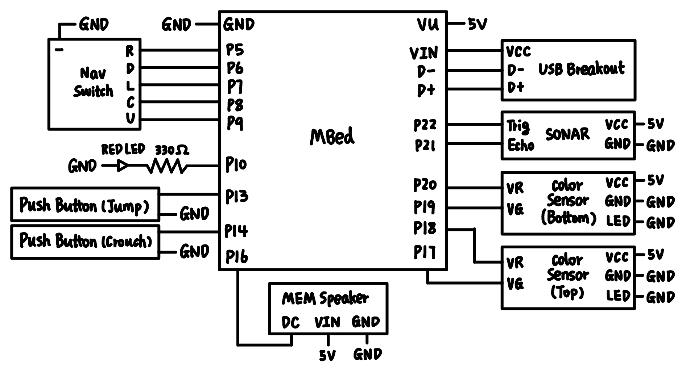
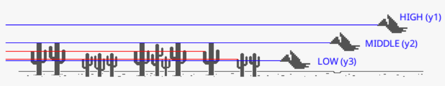

# Chrome Dino Automation

**Team Members**  
**Ruiyi Gao & Yixiao Hu**  

ECE 4180 Section B (Fall 2022) Final Project 
Georgia Institute of Technology 

## Table of Content
* [Project Idea](#project-idea)
* [Demo Videos](#demo-videos)
* [Parts List](#parts-list)
* [Block Diagram and Schematic](#block-diagram-and-schematic)
* [Software Design](#software-design)
* [Future Direction](#future-direction)
* [Source Code](#source-code)

## Project Idea
Our project idea is fairly simple!  

We want to play the chrome dino game in various ways (using different peripherals), including the ultimate goal of letting mbed play the game automatically.  

Using peripherals we used in labs, we came up with the following ways to manually play the dino game using mbed:
1. **Push Buttons**  
We used two push buttons to represent the actions of the dino. The top push button makes the dino jump and the bottom makes it crouch.  
2. **Navigation Switch**  
Similar to the button idea, if the navigation switch is toggled upward, the dino would jump. If the navigation switch is toggled downward, the dino would crouch.
3. **Microphone**  
If the user claps their hand, the dino would jump.
4. **LIDAR**  
The player could put their hand in front of the LIDAR sensor and move toward or away from it. If the distance between LIDAR is greater than 20cm, the dino would jump. If the distance between LIDAR is less than 10cm, the dino would crouch.  

## Demo Videos
We provided an all-in-one demo so you could see every feature in one place, but there are also separate videos for each feature if you want to explore more!  

**All In One Demo**  
https://youtu.be/9GH7aEYIwp4

**Push Button Demo**  
https://youtu.be/t7vQpgjw0i8

**Navigation Switch Demo**  
https://youtu.be/jdK-0nZb1SQ

**Microphone Demo**  
https://youtu.be/ZZIuClorhCs

**SONAR Demo**  
https://youtu.be/9gRKd20tYLc

## Parts List
mbed LPC1768, https://www.sparkfun.com/products/9564  
SPST Push Buttons * 2, https://www.sparkfun.com/products/9190  
Navigation Switch, https://www.sparkfun.com/products/11187  
SPW2430 Microphone, https://www.adafruit.com/product/2716  
HDJD-S822 Color Sensor * 2, https://www.sparkfun.com/products/10904  
Mini USB Breakout, https://www.sparkfun.com/products/9966  
HC-SR04 SONAR, https://www.sparkfun.com/products/15569  

## Block Diagram and Schematic
Here is the schematic for all the components we used:

**Note: All the peripherals used 5V as power, and we didn't use external power in our project.**

## Software Design
The core library of our software component is the "USBDevices" library, which receives instructions from mbed to simulate key pressing events on our laptop. However, since it occupies the SPI communication port of mbed, any device that uses the same API needs to be implemented in different threads to function correctly, especially when the peripherals were combined. We used a mutex called "key" to enforce this constraint between different threads  

### Manual Mode:
In manual mode, 4 threads were created using RTOS, controlling push buttons, navigation switch, sonar sensor, and microphone. We started by creating an independent source code for each peripheral for testing and clear demonstration. Finally, we created a combined manual control file that includes all four features in one place.  

**Push Buttons:** As explained in the project ideas, two push buttons were used to trigger the UP_ARROW and DOWN_ARROW for keyboard signal using “USBDevices”. DebounceIn was used to account for push button debouncing.  

**Navigation Switch:** Similar to Push Buttons, toggling the navigation switch upward and downward would trigger the UP_ARROW and DOWN_ARROW signals. We used the nav_switches class that was mentioned in lab1.  

**SONAR Sensor:** "HCSR04.h" library was used to control the SONAR sensor. Its member function .getDistance_mm() helps us detect the distance with a maximum limit to be 400cm. If the distance detected was less than 10cm, the DOWN_ARROW signal will be sent and it would remain for 0.2 seconds since in the game you have to press down for a while to make effectively avoid the obstacles. On the contrary, if the distance was higher than 20cm, the UP_ARROW signal was sent and another delay of 200ms was added to make sure the dinosaur won’t keep jumping for a short period of time.  

**Microphone:** SPW2430 Microphone is used to detect the volume level of the sound. If the current volume level increases by 20 compared to the previous value (indicating a clap), UP_ARROW will be sent. The reason not to use an absolute threshold was the reading wasn’t stable and usually varies between 160 to 260 under normal lab conditions, so comparing between two timestamps would make more sense.  

**All Manual:** After testing each peripherals individually, we combined all four peripherals to create a project where users could operate all four at the same time. To achieve this, we used 4 threads to detect the readings from each peripheral and one more through that makes decision on what action should the dinosour take.  

Here is a diagram showing how all the peripherals communicate with mbed and keyboard class:  

  

Here is a diagram showing the logic for the action selection:  

  
 

### Automatic Mode:
Automatic Mode used two color sensors to detect the obstacles in front of the dinosaurs and simulates a jump (UP_ARROW signal) when it is found. There are three levels of obstacles in the game: low, medium, and high. There is no need for any action for the high obstacles so two sensors were used to detect the other types accordingly. The sensors are mounted at the medium(y2) and low(y3) locations shown below.  

  

Two color sensors were placed about 7cm ahead of the dinosaur so initially a 300ms delay was added to it so that the dinosaur only jumps when it approaches the obstacle. However, since the acceleration for the game is 0.0001 from the game source code (line 116), the delay time decreases linearly with time to make sure the dinosaur jump approximately at the same distance from obstacle.  

  

We used the value of red and green together to get a more stable output that is less sensitive to noise. So the value we mention in this paragraph is simply the value of red (range 0-10) + the value of green (range 0-10). The reason we didn't use all three channel is that we observed that the blue channel usually have a very low value (no more than 5), so we didn't want it to become an outlier and influence our result.

If the game is in light mode (mode 0), the obstacles will appear in black. Therefore, the dinosaur will perform a jump action if the reading of the color sensors is below 17. If the game is in dark mode (mode 1), the obstacles will be in color grey instead of white. Therefore, the dinosaur will perform a jump action if the reading is above 7. However, due to the environmental conditions and different laptop screens, the threshold may be changed accordingly. <br<

  

  

Light and dark mode occurs alternatively and consistently with time. Thus, a timer was needed to determine the current mode. One thing worth noting was that there was another transition mode (mode 2) in between the previous two modes in which the dinosaur was forced to do nothing but forward to avoid any abrupt behavior in the transition. This is due to the fact that transition doesn’t happen instantly, and it takes about 0.5 seconds to completely change the background color which might cause issues in the color sensor. In the later game, the transition time (mode 2) has to be shortened to account for the higher velocity of the dinosaur.  

Here is a diagram showing how everything communicates:  

  

Here is a diagram showing the same logic for delivering a jump that we mentioned above:  

  

The highest score reached was 1472 for the automatic version of our program. At this point, the delay has been minimized so the constraint of the behavior depends on the hardware reaction time. Even though the total score might be improved by a few hundred depending on the randomization in the game, this project is close to fully exploring the capability of the color sensors.  

## Future Direction
**1.** In manual mode, threads could be activated using switches. The current version of the combination means the SONAR reading may impact the push button behavior. So, in the lab demo separated source files were used instead of the combined version to avoid interference.  
**2.** In automatic mode, another color sensor might be added to only detect the background color and hence, determine the mode of the game. It also helps to improve the transition mode behavior.  
**3.** Use more color sensors placed even further from the dinosaur but on the same level. Using the difference of time an obstacle passed between them to calculate the current speed and the dinosaur will receive the jumping signal accordingly. An IO expander may be needed in this case due to the limitation of the number of AnalogIn pins in mbed.  

## Source Code

All source codes are located in GitHub. Here is the link to its directory:  
https://github.com/ruiyi-gao/ECE-4180-Chrome-Dino-Project/tree/main/src

In the src directory, there are six folders.

**Automatic** contains codes that make mbed automatically play the game. 

**All_Manuel** is the threaded version of all manuel controls, so that all four features are all in one place. 

The four remaining folders **Push_Button**, **Nav_Switch**, **Microphone** and **SONAR** contains code that could independently work with that specific peripheral so you could test something out easily. The pin numbers used in all six code projects are exact same as the pin diagram mentioned above.
